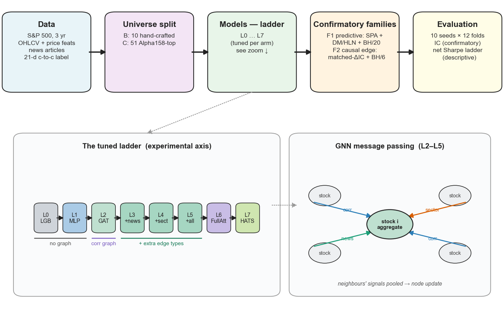
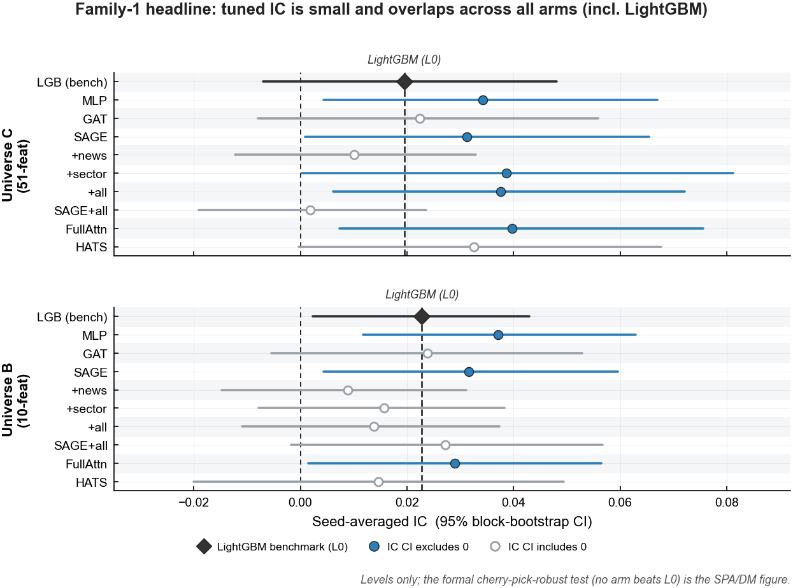
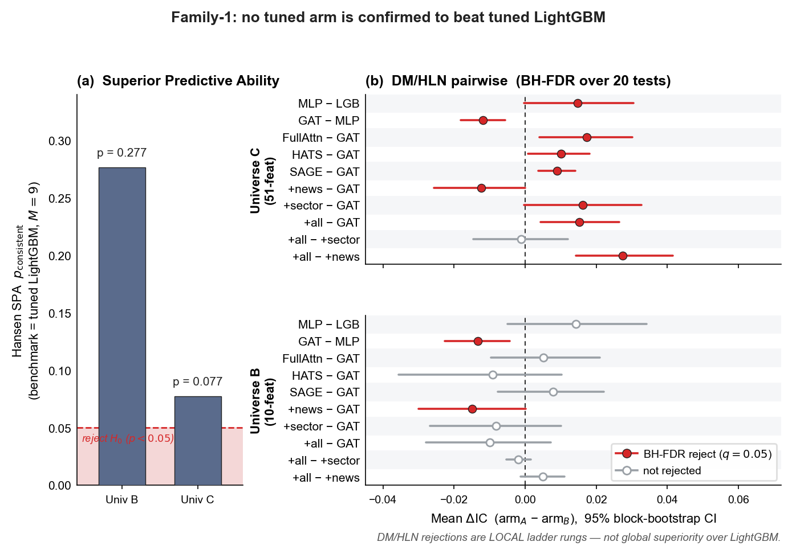
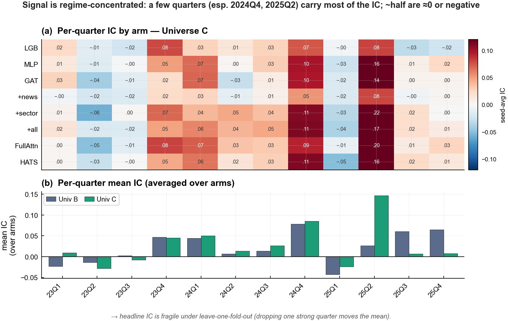
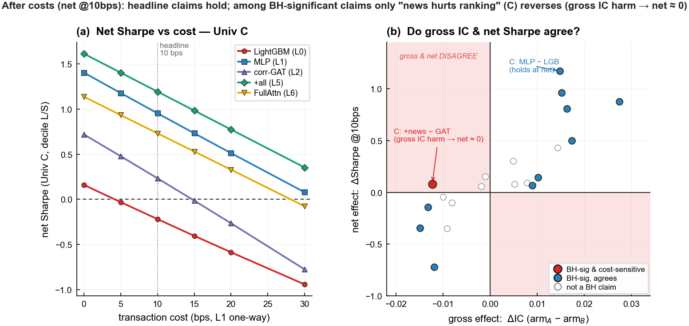
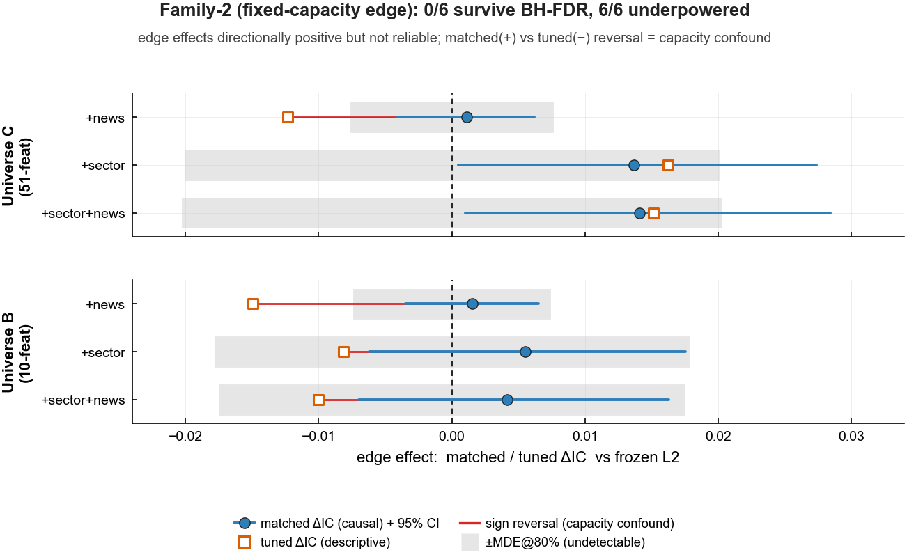
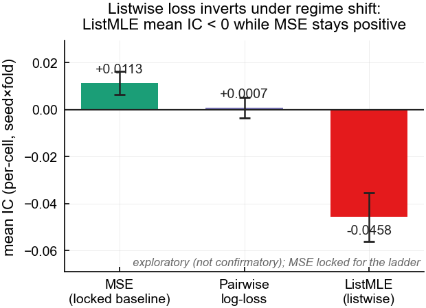
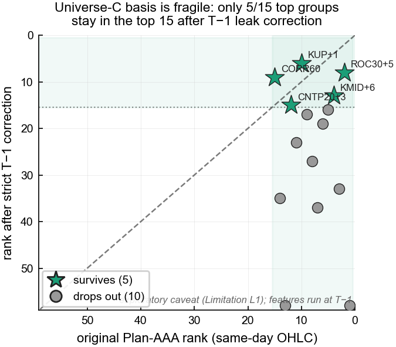

# When Do Graph Neural Networks Help in Cross-Sectional Stock Ranking?
### A Multi-Seed, Multi-Universe, Cost-Aware Study of the US S&P 500

**Confirmatory working draft for ICAIF 2026 (ACM SIGCONF, 8–10 pages).**

> **Editing notes (delete before submission).** This is the **confirmatory** draft (`storya_paper_draft_v2.md`). It is built entirely on the D-RERUN-12F confirmatory result: the **tuned L0–L7 ladder** over **12 expanding walk-forward folds × 10 seeds**, with **two pre-registered confirmatory families** (Family-1 predictive, Family-2 causal-edge) and a **descriptive net-of-cost crosswalk**. It supersedes `storya_paper_draft.md`, which was written on the untuned 4-model 5-fold *pilot* and is archived. Every numeric claim cites a source CSV under `artifacts/storya_v21_family1/`, `artifacts/storya_v21_family2_fc/`, or `artifacts/storya_v21_cost/`; change the upstream CSV before changing a number here.

> **Reading red lines (locked; see `docs/session_handoff_2026-06-24.md`).**
> 1. Two **separate** confirmatory families. Family-1 = predictive / model-selection (SPA, DM/HLN). Family-2 = causal edge-attribution (matched-ΔIC). Do not interchange their primaries.
> 2. IC is the **sole** confirmatory metric. Net Sharpe is a **descriptive** economic-sensitivity layer — never a second confirmatory family.
> 3. Hansen SPA for Universe C is *p* = 0.077 → "**fail to reject**", never "near-significant"; always pair with the underpowered/MDE qualifier.
> 4. DM pairwise rejections are **local ladder rungs**, not global superiority over LightGBM.
> 5. The C/L5s 27.5% constant-collapse is a **reported stability finding** (EXCLUDE primary); it folds into the "smoothing hurts ranking" mechanism paragraph and is **never re-tuned**.

> **Document map**: Abstract · §1 Introduction · §2 Related Work · §3 Methodology · §4 Data & Setup · §5 Results · §6 Discussion · §7 Limitations · §8 Reproducibility · Supplementary §S.

---

## Abstract

Graph neural networks (GNNs) are widely reported to improve cross-sectional stock ranking by encoding inter-stock relations as graph edges, yet these gains are almost always quoted as single-seed, single-split numbers without multiple-comparison defence. We ask a narrower and more reproducible question, namely *when*, if ever, a graph helps, and answer it under a deliberately strict protocol. We evaluate a tuned model ladder, running from a gradient-boosted-tree baseline up to a heterogeneous relational GNN (rungs L0–L7), over twelve expanding quarterly walk-forward folds and ten random seeds on the US S&P 500, with two pre-registered confirmatory families. The first family asks whether *any* tuned model beats a tuned LightGBM benchmark. Hansen's Superior Predictive Ability test fails to reject this null in both feature universes (*p* = 0.277 and *p* = 0.077); because that comparison is itself underpowered, this is a fail-to-reject rather than a claim of equality. Local Diebold–Mariano ladder rungs show that the neural lift which does exist comes from a non-graph multilayer perceptron rather than from the graph: in the richer universe the tuned MLP beats LightGBM (local ΔIC = +0.015), whereas adding a correlation-graph attention network loses to that MLP (ΔIC = −0.012). The second family isolates the *causal* effect of each edge type at a frozen network capacity; none of six edge contrasts survives Benjamini–Hochberg control, and all six are underpowered. A net-of-cost crosswalk confirms that the two load-bearing Universe-C rungs, the non-graph MLP over the tree benchmark and the correlation graph not improving on that MLP, survive a 10 bps cost. The one IC rung that does not carry to net economics, the tuned news-edge arm underperforming the correlation-GAT, is a near-zero, fold-fragile net difference that the capacity-matched causal test does not echo. We frame these as conditional findings and failure modes, and we contribute a reusable evaluation scaffold for GNN-finance work.

---

## §1. Introduction

> *Thesis: GNN claims in financial ranking are often regime-driven and seed-fragile. This paper's contribution is not a new architecture but a rigorous, pre-registered "when-does-it-work" characterization with a clean separation between predictive and causal questions.*

**Cross-sectional stock ranking** is the task of predicting, every trading day, the *relative* order of next-period returns across a fixed universe of stocks — here the constituents of the US S&P 500. A model that orders the top decile correctly yields a tradeable dollar-neutral long-short portfolio; a model that ranks no better than chance loses to transaction costs. The standard quality metric is the **Information Coefficient (IC)**, the cross-sectional Spearman rank correlation between predicted scores and realised forward returns, averaged over test days.

Recent graph neural network papers — most prominently Feng et al. (2019, *TOIS*) on temporal relational ranking, Kim et al. (2019) on HATS, and Sawhney et al. (2021, AAAI) on STHAN-SR — report sizeable IC gains by encoding inter-stock relations (sector membership, Wikidata ontologies, news co-mentions) as graph edges and applying message passing. These headline gains are almost always quoted as *single-seed* and *single-split* numbers. Three concerns motivate a closer and more disciplined look.

First, **single-seed inflation and cross-seed dispersion** are large in this regime. Even after tuning and seed-averaging, the per-arm 95% bootstrap CIs here are as wide as the IC point estimates themselves — the Universe-C correlation-GAT pooled IC of 0.0224 carries a 95% CI of [−0.0080, +0.0559] (source `artifacts/storya_v21_family1/family1_ic_ci.csv`) — so a single-seed, single-split number can land almost anywhere in that band. Re-tuning hyperparameters does not remove this dispersion; only multi-seed evaluation surfaces it. Second, **regime concentration**: cross-sectional ranking profit is episodic, and a single high-dispersion quarter can dominate an annual number, so a positive pooled IC can be the artefact of one good quarter unless per-fold behaviour is disclosed. Third, **capacity confounding**: when each model rung is independently tuned under an equal compute budget, an edge ablation that compares differently-sized networks confounds "did the edge help" with "did the bigger network help", so a clean causal read of an edge requires holding capacity fixed.

We address all three with a single tuned ladder and two *separate* pre-registered confirmatory families. The **predictive family** (Family-1) asks the model-selection question — does any tuned arm beat a tuned LightGBM — using Hansen's Superior Predictive Ability (SPA) test over nine candidates, with Diebold–Mariano/Harvey–Leybourne–Newbold (DM/HLN) pairwise tests under Benjamini–Hochberg (BH) false-discovery-rate control as local evidence. The **causal family** (Family-2) freezes the full hyperparameter vector of the correlation-graph operating point and varies *only* the edge set, so the matched ΔIC isolates the pure edge effect at fixed capacity. The pipeline is summarised in **Figure 1**.



**Figure 1.** End-to-end confirmatory pipeline. Raw daily OHLCV for the S&P 500 → per-day cross-sectional feature matrix (Universe B, 10 hand-crafted dimensions; or Universe C, 51 Alpha158 columns) → graph snapshot (rolling-correlation edges, optionally augmented with GICS-sector or point-in-time news co-occurrence edges) → one rung of the tuned L0–L7 ladder → cross-sectional ranking → top-decile equal-weight dollar-neutral long-short portfolio rebalanced every 21 trading days → evaluation by pooled IC, the two confirmatory families (Hansen SPA / DM-HLN; matched-edge ΔIC), and a descriptive gross/net cost crosswalk. The inset magnifies the L0→L7 ladder; the right panel sketches one message-passing step.

> **What "Universe B" and "Universe C" mean (used throughout).** Both are the *same set of stocks*; they differ only in the features each stock carries. **Universe B** is a 10-dimensional minimalist hand-crafted set built from price and volume alone (three windowed return means `ret_mean_{5,10,21}d`, three windowed return standard deviations `ret_std_{5,10,21}d`, `mom12m`, `maxret`, `dolvol`, `CORR5`); the "B" stands for *baseline*. **Universe C** is a 51-dimensional subset of Microsoft Qlib's Alpha158 factor library (top-15 factor groups by the project's earlier ranking); the "C" stands for *composite*. All values are taken strictly at T − 1. We compare two universes of very different richness to test whether GNN advantage depends on how strong the node features already are.

**Headline findings (confirmatory).** No tuned arm is confirmed to beat tuned LightGBM: Hansen SPA does not reject in either universe (Universe B *p*<sub>consistent</sub> = 0.277, Universe C *p*<sub>consistent</sub> = 0.077; source `artifacts/storya_v21_family1/family1_spa.csv`), and the vs-LightGBM comparison is underpowered — the observed gaps fall below the 80% minimum detectable effect (e.g. Universe C L1−L0 observed +0.0148 vs MDE = 0.0220; source `family1_mde.csv`) — so this is a fail-to-reject, not evidence of equality. The neural lift that exists is carried by the non-graph MLP rather than the graph: in Universe C the tuned MLP beats tuned LightGBM (L1−L0 ΔIC = +0.0148, HLN *p* = 0.011, BH-reject) while adding a correlation-graph attention layer loses to that MLP (L2−L1 ΔIC = −0.0119, *p* = 6.9 × 10⁻⁶, BH-reject) — both are *local* ladder rungs, not global SPA wins (source `family1_dm_hln.csv`). The causal edge family finds **0 / 6** contrasts surviving BH-FDR and **6 / 6** underpowered (source `artifacts/storya_v21_family2_fc/family2_fc_causal.csv`). Under a net-of-cost economic口径, the Universe-C L1−L0 rung (MLP over the tree benchmark) and L2−L1 rung (correlation graph not improving on the MLP) both hold at 10 bps, while the one IC rung that flips口径 — the tuned news-edge arm (L3−L2) underperforming corr-GAT on ranking — is a near-zero, fold-fragile net difference, flagged cost-sensitive and not echoed by the capacity-matched causal test (source `artifacts/storya_v21_cost/cost_headline_crosswalk.csv`). We frame these as *conditional findings* and *failure modes*, not as architecture-supremacy claims.

---

## §2. Related Work

> *Thesis: prior GNN-finance papers report headline gains but routinely omit at least one of {multi-seed, multi-fold, capacity-matched edge attribution, cost ladder, point-in-time news, multiple-comparison control}.*

### §2.1 GNN baselines for stock ranking

Feng et al. (2019, *TOIS*) frame stock prediction as learning-to-rank over industry and Wikidata relation graphs with a temporal graph-convolution and a pairwise ranking loss, reporting IC and return on a single NASDAQ/NYSE split. Kim et al. (2019) introduce **HATS**, a hierarchical graph-attention network over 75 Wikidata relation types for next-day movement; it is the blueprint for our **HATS-3R-adapt** rung (L7), which restricts the relations to correlation, GICS sector, and news co-occurrence and switches the head to 21-day cross-sectional ranking. Sawhney et al. (2021, AAAI) re-frame selection as ranking over a spatiotemporal hypergraph (STHAN-SR), again on a fixed split with few seeds and no SPA or DM/HLN test. The common thread is rich relational structure evaluated under single-seed, single-split conditions.

### §2.2 Methodology-leaning quant finance

Hou, Xue & Zhang (2020, *RFS*) replicate 452 cross-sectional anomalies under a uniform protocol and find 65% fail multiple-comparison-corrected replication; we adopt that discipline. López de Prado (2018) codifies block bootstrap and purge-and-embargo cross-validation, which we use in §3.1 and §3.3. Hansen (2005) supplies the SPA test we use as the headline cherry-pick defence, with Politis & Romano (1994) providing its stationary bootstrap and Newey & West (1987) the HAC standard errors used throughout.

### §2.3 Position relative to prior work

To our knowledge this is the first study to combine, on the S&P 500, all of: 10 seeds × 12-fold expanding walk-forward × a tuned model ladder × **two separate pre-registered confirmatory families** (predictive SPA/DM-HLN *and* capacity-matched causal edge attribution) × a gross/net cost ladder × point-in-time news handling × explicit disclosure of a tuned-config stability failure. **Table T8** makes the gap explicit. The entries reflect each work's *reported* evaluation protocol; "✗" marks a property the paper does not report, not a claim that the property is impossible for that method.

**Table T8 — Related-work evaluation matrix.**

| Work | Venue / year | Graph / relation | Test design | Multi-seed | SPA / DM-FDR defence | Cost ladder |
|:---|:---|:---|:---|:---:|:---:|:---:|
| Feng et al. [1] | TOIS 2019 | industry + Wikidata | single split | ✗ | ✗ | ✗ |
| Kim et al. (HATS) [2] | IJCAI-W 2019 | 75 Wikidata relations | single split | ✗ | ✗ | ✗ |
| Cheng & Li (AD-GAT) [17] | AAAI 2021 | unmasked learned attention | single split | ✗ | ✗ | ✗ |
| Sawhney et al. (STHAN-SR) [3] | AAAI 2021 | spatiotemporal hypergraph | single split | few | ✗ | ✗ |
| Lin et al. (TRA) [18] | KDD 2021 | temporal routing (no graph) | single split | ✗ | ✗ | ✗ |
| Li et al. (MASTER) [19] | AAAI 2024 | market-guided attention | single split | ✗ | ✗ | ✗ |
| Chen et al. (FinMamba) [20] | arXiv 2025 | dynamic pruned graph + Mamba | single split | ✗ | ✗ | profit only |
| **This work** | — | tuned corr / sector / news ladder + fixed-capacity edge arm | 12-fold expanding WF | **10 seeds** | **SPA + DM-HLN + BH-FDR (two families)** | **0–30 bps** |

Most prior GNN-finance work reports a point estimate on a single chronological split, without multi-seed dispersion, a Hansen-SPA or BH-FDR cherry-pick defence, or a transaction-cost ladder; point-in-time news handling is also rarely made explicit. The present study's contribution is methodological coverage of all of these at once, applied to a tuned ladder rather than a single architecture. Full per-paper annotations are in `docs/storya_references.md`.

---

## §3. Methodology

> *Thesis: a reader should be able to reproduce the protocol from this section alone. We separate the protocol (here) from the experiments that use it (§5).*

### §3.1 Walk-forward cross-validation

Time-series prediction must be evaluated chronologically. We use a **12-fold expanding-window walk-forward**: for fold *k* the training set is all data up to a quarter boundary, the validation set is the next quarter, and the test set is the quarter after that. The twelve test quarters span **2023 Q1 through 2025 Q4**, giving *T* = 749 pooled test days. Because the label is a 21-day forward return, we drop the final 21 trading days of each training set (a **purge embargo**) to eliminate label overlap between train and test. A secondary sliding-252-day axis is reported as robustness only and carries no independent inference.

### §3.2 Information Coefficient and portfolio construction

**Daily IC** is the cross-sectional **Spearman rank correlation** between predictions and next-day 21-day-forward returns, over all stocks with non-missing features that day. Headline IC is the pooled mean over all test days across all 12 folds. We use Spearman because rank IC is invariant to monotonic transforms of predictions and is the factor-investing convention. For day *t* with *n*<sub>t</sub> valid stocks and rank differences *d*<sub>i</sub> between predicted and realised return ranks,

```
                  6 · Σᵢ dᵢ²
   IC_t  =  1 − ─────────────────  ,   IC ∈ [−1, 1].
                  n_t · (n_t² − 1)
```

**Portfolio.** Each day, sort by predicted score, long the top *K* and short the bottom *K* with *K* = ⌊10 % × *n*<sub>valid</sub>⌋, equal-weight and dollar-neutral, rebalanced every 21 trading days. Let *r*<sub>t</sub><sup>L/S</sup> be the daily long-short return; then

```
   Sharpe  =  mean(r^L/S) / std(r^L/S) · √(252 / 21).
```

**Gross Sharpe** ignores frictions; **net Sharpe** subtracts one-way transaction cost at {0, 5, 10, 15, 20, 30} bps per rebalance (net return = gross − turnover<sub>L1</sub> × bps / 10000), with the headline cost level at **10 bps**. Net Sharpe is reported only as a descriptive economic-sensitivity layer (§3.5).

### §3.3 Two confirmatory families

> **In plain English.** We ask two different questions and keep them statistically separate. *Did any model win?* is a model-selection question answered against multiple candidates (Family-1). *Did this specific edge cause an improvement?* is a controlled-intervention question answered by changing only the edge while holding everything else fixed (Family-2). Mixing the two is the most common way GNN-finance papers over-claim.

**Family-1 — predictive / model-selection.** The benchmark is the tuned LightGBM rung (L0); the candidates are the nine other tuned rungs (L1, L2, L2s, L3, L4, L5, L5s, L6, L7). We run **Hansen SPA** (consistent variant, loss = −daily IC, stationary block bootstrap, block = 21 d) to ask whether the best of the *M* = 9 candidates beats the benchmark after accounting for selection. As *local* evidence we run **DM/HLN** paired tests on a **pre-registered family of 20** contrasts — five ladder rungs {L1−L0, L2−L1, L6−L2, L7−L2, L2s−L2} and five edge-DAG rungs {L3−L2, L4−L2, L5−L2, L5−L4, L5−L3}, in each of the two universes — under **BH-FDR control at q = 0.05**. The DM statistic uses Newey-West HAC standard errors; the HLN factor √((T + 1 − 2h + h(h−1)/T)/T) with *h* = 21 corrects for the small *T*/*h* ratio. A secondary `HLN_p_t_lag21` column is reported so that marginal rungs are not called robust without checking a fixed-lag HAC.

**Family-2 — causal edge-attribution.** The capacity confound (§1) means a tuned-vs-tuned edge comparison is not a clean edge effect. We therefore add **fixed-capacity (FC)** arms that run L3/L4/L5's edge sets at the **frozen tuned hyperparameter vector of L2** (the correlation-graph operating point), varying *only* the edge set. The **matched ΔIC** then isolates the pure edge effect at the L2 operating point. Inference is the paired fold-level seed-averaged ΔIC over the *n* ≈ 12 fold blocks, with a block bootstrap over folds and **BH-FDR over the six contrasts**. The per-row block-bootstrap CIs are unadjusted descriptive intervals; the BH-FDR decision is the family-level confirmatory call.

**Power and minimum detectable effect.** For every contrast we report a minimum detectable effect MDE = 2.8 × SE<sub>block</sub> with the effective number of 21-day blocks *n*<sub>eff</sub> = *T*<sub>days</sub>/21, so that "fail to reject" can be distinguished from "no effect". A 21-day-overlapping √750 power calculation would be anti-conservative and is not used.

### §3.4 Multiple-comparison framework and pre-registration

> **In plain English.** **Hansen SPA** is one-vs-many: after picking the best of several candidates, is that winner truly better than the benchmark, or did selection make a noisy candidate look good? **DM/HLN** is one-vs-one: is the mean daily ΔIC for a single pair reliably non-zero? **BH-FDR** caps the expected fraction of false "significant" calls across a family at q = 0.05. **Pre-registration** means writing down — before any GPU launch — the primary metric, the positive-verdict gate, and the confirmatory families, so a sceptical reader can check the published claims line-by-line against the locked plan.

The frozen protocol (`docs/protocol_v2_freeze.md`) and the frozen tuned hyperparameters (`artifacts/storya_v21_tune/frozen_hparams.json`, md5 `59ddd0a2`) were committed before the confirmatory launch. The two confirmatory families above are the *only* inferential families; all prior work (horizon ablation, the loss-function horse race, the Plan-AAA factor ranking) is flagged **exploratory** and is disclosed but never allowed to count as confirmatory evidence.

### §3.5 Cost crosswalk as a descriptive layer

Because the headline is stated in IC (a gross rank metric), §5.4 re-expresses each pre-registered claim under a net-of-cost economic口径. **Net Sharpe is a descriptive economic-sensitivity layer; IC remains the sole confirmatory metric** — no third BH-FDR family is opened on Sharpe, which would over-claim and add multiplicity. The gross ΔIC and BH decision are copied verbatim from the Family-1 outputs; per-pair net ΔSharpe is fold-level seed-averaged with a stationary block bootstrap; the degenerate C/L5s cells are excluded to match Family-1.

---

## §4. Data and Experimental Setup

### §4.1 Universe, label, and seeds

The universe is the S&P 500 constituents as of each trading day; frequency is daily close-to-close. The **label** is the next-day cross-sectionally z-scored **21-day forward log return**, locked across all experiments and never revised. Ten canonical seeds {7, 34, 86, 99, 123, 456, 789, 1024, 2024, 2026} are used everywhere.

### §4.2 Feature universes

**Universe B** is the 10-dimensional hand-crafted set (`ret_mean_{5,10,21}d`, `ret_std_{5,10,21}d`, `mom12m`, `maxret`, `dolvol`, `CORR5`), all at T − 1. **Universe C** is the 51-dimensional top-15-group subset of Qlib's Alpha158 library; its composition basis has a known stability caveat (Limitation L1). All Universe-C values are evaluated at T − 1, so the runtime features are not leaked even though the *basis* for selecting them is fragile.

### §4.3 The tuned L0–L7 ladder

Each rung changes exactly one design choice relative to the rung below it, so a rung-to-rung ΔIC isolates one factor. Every rung is independently tuned under an equal compute budget (Optuna, *N* = 30 trials per arm, six hyperparameter dimensions per family, centred on the pilot defaults; `docs/protocol_v2_freeze.md` §4).

**Table T0 — The model ladder.**

| Rung | Model / graph | Isolates |
|:---|:---|:---|
| **L0** | LightGBM (tuned), no graph | non-neural tabular benchmark |
| **L1** | MLP, no graph | value of going neural |
| **L2** | GAT + α1 correlation graph | value of adding a graph |
| **L2s** | GraphSAGE-Mean + α1 | aggregation-operator control vs L2 |
| **L3** | GAT + α1 ∪ news edges | marginal value of news edges |
| **L4** | GAT + α2 (corr + GICS sector) | marginal value of sector edges |
| **L5** | GAT + α4 (corr + sector + news) | edge-stacking complementarity |
| **L5s** | GraphSAGE-Mean + α4 | aggregation control on the full edge set |
| **L6** | full self-attention, no graph mask | attention-vs-structure arbiter (dense learned-attention family; MASTER [19] / AD-GAT [17], not learned-sparse) |
| **L7** | HATS-3R-adapt | domain relation-attention representative (per-relation parameterisation after R-GCN [21]) |

*Graph construction.* α1 = 126-day rolling Spearman correlation, edge if |ρ| > 0.6, snapshot refreshed every 21 days from training data only. α2 = static GICS 11-sector full-connectivity. α3/news = point-in-time co-occurrence (two stocks share an edge on day *T* if co-mentioned in an article published before NYSE close of T − 1). α4 = corr + sector + news.

### §4.4 Cell budget

The confirmatory main table is **2160 cells** for the nine non-HATS rungs (9 arms × 2 universes × 12 folds × 10 seeds) plus **240** L7/HATS cells, with **720** fixed-capacity Family-2 cells (L3fc/L4fc/L5fc × 2 × 12 × 10). Each of these three stores is internally complete (0 failed, 0 duplicate `cell_id`) and is consumed separately by its family (see ST1c). The L7 contingency rule (an automatic health gate that demotes HATS out of the family if >20% of its cells diverge or collapse) was **not triggered** (diverge fraction 0, collapse fraction 0; source `family1_summary.md`), so L7 stays in the family and SPA runs at *M* = 9.

---

## §5. Results

> *Thesis: the per-arm bootstrap CIs say several arms have non-zero IC; SPA says none of them is confirmed to beat LightGBM; the local DM ladder says the lift is MLP-shaped, not graph-shaped; the causal family says no edge effect survives multiplicity; and the cost crosswalk says the two load-bearing claims survive net economics while the one IC claim that flips口径 does not. All must be told in sequence.*

### §5.1 Headline IC ladder

We first show per-arm pooled IC with 95% block-bootstrap CIs (seed-averaged, *T* = 749). **Table 1** and **Figure 2** are the anchor.

**Table 1 — Per-arm pooled IC with 95% block-bootstrap CI.** Source `artifacts/storya_v21_family1/family1_ic_ci.csv`.

| Rung | Univ B IC [95% CI] | excl. 0 | Univ C IC [95% CI] | excl. 0 |
|:---|:---|:---:|:---|:---:|
| L0 LightGBM | 0.0228 [0.0024, 0.0429] | yes | 0.0195 [−0.0070, 0.0481] | no |
| L1 MLP | 0.0371 [0.0118, 0.0630] | yes | 0.0343 [0.0044, 0.0669] | yes |
| L2 GAT(corr) | 0.0238 [−0.0054, 0.0528] | no | 0.0224 [−0.0080, 0.0559] | no |
| L2s SAGE(corr) | 0.0317 [0.0044, 0.0596] | yes | 0.0313 [0.0009, 0.0654] | yes |
| L3 +news | 0.0089 [−0.0148, 0.0312] | no | 0.0101 [−0.0122, 0.0329] | no |
| L4 +sector | 0.0157 [−0.0078, 0.0383] | no | 0.0386 [0.0002, 0.0812] | yes |
| L5 +sector+news | 0.0138 [−0.0110, 0.0373] | no | 0.0375 [0.0061, 0.0721] | yes |
| L5s SAGE(all) | 0.0272 [−0.0017, 0.0567] | no | 0.0018 [−0.0190, 0.0236] | no |
| L6 full-attn | 0.0290 [0.0015, 0.0564] | yes | 0.0397 [0.0073, 0.0756] | yes |
| L7 HATS | 0.0147 [−0.0200, 0.0494] | no | 0.0325 [−0.0003, 0.0678] | no |



**Figure 2.** Per-arm pooled IC forest for the L0–L7 ladder in both universes, with the tuned LightGBM (L0) reference line; a marker whose CI excludes zero has non-zero ranking ability at this design. *Seeds = 10; folds = 12 (expanding walk-forward, 2023 Q1–2025 Q4); metric = pooled cross-sectional Spearman IC; intervals = 95% stationary block-bootstrap (block = 21 d, 5000 reps); benchmark = L0 tuned LightGBM. Source: `family1_ic_ci.csv`.*

**Reading Table 1.** Several arms have CIs that exclude zero — most consistently the non-graph MLP (L1, both universes) and the full-attention arm (L6). The two pure correlation-GAT rungs (L2) do *not* exclude zero in either universe. Per-arm non-zero IC, however, is a weaker statement than "beats the benchmark", which the next subsection addresses with multiplicity control. C/L5s sits at IC ≈ 0.002 because a quarter of its cells collapsed (§5.6); it is excluded from every confirmatory test except the SPA candidate set.

### §5.2 The predictive family: SPA and DM/HLN

**Hansen SPA fails to reject "no candidate beats LightGBM" in both universes** — Universe B *p*<sub>consistent</sub> = 0.2767, Universe C *p*<sub>consistent</sub> = 0.0774 (M = 9, T = 749; source `family1_spa.csv`). Universe C is the smaller of the two p-values but **does not reject at 5%**, and the comparison against LightGBM is underpowered (§5.2, MDE), so this is a *fail-to-reject*, not a near-miss. The cherry-pick-robust verdict is therefore: **no tuned arm is confirmed to beat tuned LightGBM.**

The local DM/HLN ladder, under BH-FDR over the 20-test family, tells a sharper mechanistic story (**Table 2**, **Figure 3**).

**Table 2 — DM/HLN pairwise ladder (seed-averaged daily ΔIC, HLN-t p, BH-FDR over the 20-test family).** Source `family1_dm_hln.csv`.

| Pair (A−B) | Univ B ΔIC | B HLN p | B BH-rej | Univ C ΔIC | C HLN p | C BH-rej |
|:---|---:|---:|:---:|---:|---:|:---:|
| L1 − L0 (MLP vs LGB) | +0.0143 | 0.052 | no | +0.0148 | 0.011 | **yes** |
| L2 − L1 (add graph vs MLP) | −0.0133 | 4.0e-4 | **yes** | −0.0119 | 6.9e-6 | **yes** |
| L6 − L2 (full-attn vs GAT) | +0.0052 | 0.356 | no | +0.0174 | 1.0e-3 | **yes** |
| L7 − L2 (HATS vs GAT) | −0.0091 | 0.195 | no | +0.0102 | 1.8e-3 | **yes** |
| L2s − L2 (SAGE vs GAT) | +0.0079 | 0.118 | no | +0.0089 | 1.8e-4 | **yes** |
| L3 − L2 (+news vs GAT) | −0.0149 | 0.0059 | **yes** | −0.0123 | 0.0086 | **yes** |
| L4 − L2 (+sector vs GAT) | −0.0081 | 0.227 | no | +0.0163 | 0.012 | **yes** |
| L5 − L2 (+both vs GAT) | −0.0100 | 0.110 | no | +0.0152 | 1.0e-4 | **yes** |
| L5 − L4 (+news on sector) | −0.0019 | 0.172 | no | −0.0011 | 0.831 | no |
| L5 − L3 (+sector on news) | +0.0049 | 0.066 | no | +0.0275 | 5.9e-8 | **yes** |



**Figure 3.** Left: Hansen SPA *p*<sub>consistent</sub> per universe with the 5% reject region shaded; neither universe rejects. Right: the 20 DM/HLN ladder rungs as a BH-FDR forest (ΔIC ± CI), filled = BH-reject, hollow = not, split into Universe C and Universe B sharing a common axis. *Seeds = 10; folds = 12; metric = pooled Spearman IC; DM/HLN with NW-HAC SE + HLN small-sample correction (h = 21); BH-FDR q = 0.05 over the 20-test family; benchmark = L0. Source: `family1_spa.csv`, `family1_dm_hln.csv`, `family1_mde.csv`.*

**Reading Table 2 (bounded).** *Within this tuned ladder*, the neural lift comes from the non-graph MLP and the graph does not add to it: in the richer Universe C the MLP beats LightGBM (L1−L0 = +0.0148, BH-reject) while the correlation-GAT loses to the MLP (L2−L1 = −0.0119, BH-reject), and the tuned news-edge arm loses to the correlation-GAT (L3−L2 = −0.0123, BH-reject). These are **local ladder rungs**, not a global "graphs hurt" claim: the sector, full-attention, HATS, and combined-edge arms (L4, L6, L7, L5) all recover *above* the correlation-GAT in Universe C, and the SPA non-rejection is the multiplicity-honest summary that *no* rung is confirmed to beat L0. The news-edge harm is the only edge result that is BH-significant on *ranking*; §5.4 shows it does not survive translation to net economics.

### §5.3 Regime concentration across the twelve folds

Pooled IC hides that cross-sectional skill is episodic. **Figure 4** disaggregates IC by fold.



**Figure 4.** Per-arm × per-quarter IC heatmap (rungs × 12 folds) with a per-quarter mean-IC bar. Skill is concentrated in a minority of quarters (notably 2024 Q4 and 2025 Q2), while roughly half the quarters sit near zero or negative for nearly every arm. *Seeds = 10; folds = 12; metric = per-fold pooled Spearman IC; source: `experiments/storya_v21_main12_tuned/results.csv`.* **Takeaway**: a pooled IC is an average over a strongly non-stationary series; per-fold disclosure is mandatory, and any single-quarter Sharpe should be read with its period count, never annualised from three rebalances.

### §5.4 Net-of-cost crosswalk (descriptive)

Every pre-registered ranking claim is now re-expressed under a 10 bps net-of-cost口径 (**Table 3**, **Figure 5**). IC remains the sole confirmatory metric; net Sharpe is descriptive.

**Table 3 — Gross/net crosswalk for the load-bearing Universe-C claims.** Source `artifacts/storya_v21_cost/cost_headline_crosswalk.csv` and `cost_ladder_by_arm.csv`.

| Pair | Local rung (Universe C, on IC) | Gross ΔIC (BH) | Net ΔSharpe @10 bps [CI] | Carries? |
|:---|:---|:---|:---|:---:|
| C L1−L0 | tuned MLP vs tuned LightGBM | +0.0148 (reject) | **+1.17 [+0.36, +2.08]** | yes |
| C L2−L1 | corr-GAT vs MLP (graph rung) | −0.0119 (reject) | **−0.72 [−1.42, −0.10]** | yes |
| C L3−L2 | +news edge vs corr-GAT (news rung) | −0.0123 (reject) | +0.08 [−0.77, +0.89] | **no (cost-sensitive)** |
| C L5−L3 | +sector on top of news | +0.0275 (reject) | +0.88 [+0.12, +1.65] | yes |



**Figure 5.** Left: the net-Sharpe cost ladder (0–30 bps) for the Universe-C arms; tuned LightGBM (L0) is already negative at 10 bps while the MLP (L1) stays positive. Right: gross-IC-vs-net-Sharpe sign agreement across the 20 pre-registered pairs, with the single sign-flip (C L3−L2, news) annotated. *Seeds = 10; folds = 12; net口径 = 10 bps one-way on L1 turnover; per-pair net ΔSharpe = fold-level seed-averaged, stationary block bootstrap; C/L5s degenerate cells excluded. Source: `cost_headline_crosswalk.csv`, `cost_pairwise_dsharpe.csv`, `cost_ladder_by_arm.csv`.*

**Reading Table 3.** The two load-bearing Universe-C rungs survive net economics with CIs excluding zero. The economic separation behind the L1−L0 (MLP-over-tree) rung is in fact *starker* than the +0.0148 IC gap: tuned LightGBM's own net Sharpe @10 bps is **negative** (−0.22) while the MLP's is **+0.95** (source `cost_ladder_by_arm.csv`, Univ C L0/L1), though the paired net ΔSharpe erodes mildly with cost as the MLP pays down its higher turnover (2.90 vs 2.25). Because the per-arm net Sharpe is heavy-tailed (MLP mean +0.95 vs median +0.18), the ranking rests on the fold-level paired ΔSharpe, not the per-arm mean. The one cost-sensitive result is **C L3−L2**: the BH-significant IC underperformance of the news-edge rung versus corr-GAT does **not** carry to net Sharpe (net ΔSharpe @10 bps = +0.08, CI [−0.77, +0.89] straddling zero, sign-unstable across folds). The honest reading takes the net bootstrap CI as primary: the ranking-level underperformance does not reproduce economically, but the net difference is itself indistinguishable from zero — and this is a local IC rung, **not** a causal or economic statement that news edges help or hurt (the capacity-matched Family-2 contrast finds no news effect; §5.5).

### §5.5 The causal family: matched-capacity edge attribution

Family-1's news-edge result is a tuned-vs-tuned ladder rung and therefore confounds the edge with capacity. Family-2 removes that confound by running each edge set at the frozen L2 hyperparameter vector (**Table 4**, **Figure 6**).

**Table 4 — Family-2 fixed-capacity edge contrasts (matched ΔIC, BH-FDR over 6).** Source `artifacts/storya_v21_family2_fc/family2_fc_causal.csv`.

| Universe | Edge added | Matched ΔIC [CI] | BH-rej | Underpowered | Tuned ΔIC | Same sign? |
|:---|:---|:---|:---:|:---:|---:|:---:|
| B | news (L3) | +0.0015 [−0.0035, +0.0065] | no | yes | −0.0149 | no |
| B | sector (L4) | +0.0055 [−0.0062, +0.0175] | no | yes | −0.0081 | no |
| B | sector+news (L5) | +0.0042 [−0.0070, +0.0163] | no | yes | −0.0100 | no |
| C | news (L3) | +0.0011 [−0.0041, +0.0062] | no | yes | −0.0123 | no |
| C | sector (L4) | +0.0137 [+0.0005, +0.0274] | no | yes | +0.0163 | yes |
| C | sector+news (L5) | +0.0141 [+0.0010, +0.0284] | no | yes | +0.0152 | yes |



**Figure 6.** Matched-ΔIC (causal) vs tuned-ΔIC (descriptive) for the six edge contrasts, with the ±MDE@80% band; no contrast clears the band and none survives BH-FDR. The Universe-B sign reversals (matched positive, tuned negative) reveal the capacity confound. *Seeds = 10; folds = 12; matched ΔIC = fold-level seed-averaged at the frozen L2 HP vector, block bootstrap over 12 folds, BH-FDR q = 0.05 over 6 contrasts. Source: `family2_fc_causal.csv`.*

**Reading Table 4.** **0 / 6 contrasts survive BH-FDR and 6 / 6 are underpowered** (|matched ΔIC| < MDE@80%): edge effects are "directionally positive but not family-significant", and fail-to-reject is not no-effect. The Universe-B reversals — matched ΔIC positive (+0.0015 to +0.0055) where the tuned ΔIC was negative — are informative evidence that the **capacity confound** masked a small positive edge effect at fixed capacity. In Universe C the sector (+0.0137) and sector+news (+0.0141) contrasts agree in sign with their tuned counterparts, while the news contrast is small, positive (+0.0011), and **opposite-signed** to its negative tuned rung (−0.0123) — so even the one edge that looked harmful on the tuned ladder is not harmful at fixed capacity. The clean causal read is therefore weaker and more honest than the tuned ladder: at fixed capacity the edges neither clearly help nor clearly hurt.

### §5.6 A tuned-config stability failure (C/L5s)

One SAGE-Mean control arm under the full edge set in Universe C (C/L5s) **degenerates to a constant prediction in 27.5% of its test fold-seeds** (25 fully + 8 partially collapsed of 120; source `family1_stability.csv`). This is verified *not* a training crash: the cells report `converged_flag = 1` with `best_val_loss ≈ 0.998`, the no-signal plateau of predicting the cross-sectional mean, at which the cross-sectional Spearman IC is mathematically undefined (0/0). The mechanism is SAGE-mean aggregation over a dense edge set combined with the arm's tuned dropout of 0.5, which smooths the signal away — the same "smoothing hurts ranking" mechanism that explains why adding a correlation graph (L2) does not beat the MLP (L1). The arm is treated as missing (primary = EXCLUDE; undefined ≠ a measured zero) and is **never re-tuned**, since re-tuning a single losing arm under an equal-budget design would be cherry-picking. The conclusion is invariant to the treatment: under {exclude, zero-fill, zero-skill} the C/L5s mean IC stays ≈ 0 (0.0018 / 0.0009 / 0.0002; source `family1_cl5s_robustness.csv`), and the Universe-C SPA *p*<sub>consistent</sub> is stable across the two treatments for which it is computed (exclude 0.0774, zero-fill 0.0795; the zero-skill-cell treatment yields the IC value above but no SPA *p* is reported in the CSV).

### §5.7 Exploratory failure modes (not confirmatory)

> *These two results sit outside the confirmatory families and are disclosed for transparency only; they are clearly labelled exploratory and use MSE-locked or historical data.*

**Listwise-loss inversion.** On a historical loss-function horse race (MSE vs ListMLE vs pairwise log-loss on a shared scaffold; MSE was locked for the confirmatory ladder), no loss family beat MSE on headline IC, and ListMLE exhibited a systematic regime-shift inversion (**Figure 7**): its per-cell mean IC is **−0.0458** versus MSE's **+0.0113** and pairwise's **+0.0007** (source `experiments/loss_horserace/results.csv`). The mechanism is mathematical — ListMLE's softmax-likelihood objective is dominated by the in-distribution rank order, so when test ranks shift the loss landscape inverts and the model produces anti-rankings. We retain this as a cautionary failure mode for ranking-loss practitioners.



**Figure 7 (exploratory).** Mean IC per loss family on the historical loss horse race, per-cell aggregation with ±1 SE; ListMLE inverts to a negative mean IC while MSE stays positive. *Not a confirmatory result — MSE is the locked confirmatory loss. Source: `experiments/loss_horserace/results.csv`.*

**Universe-C basis fragility (Plan-AAA, T − 1).** The Universe-C composition is the project's earlier Plan-AAA top-15 Alpha158 groups, originally ranked under a same-day-OHLC procedure; under strict T − 1 leak correction only **5 of the top 15** groups stay in the top 15 (the survivors are ROC30+5, KMID+6, KUP+1, CNTP20+3, CORR60; source `artifacts/plan_aaa_t1_diagnostic/group_ranking_comparison.csv`), as shown in **Figure 8**. Universe-C *runtime* features are evaluated at T − 1 and are therefore not leaked, but the *basis* for selecting them is fragile, which bounds how far the Universe-C IC numbers should be generalised (Limitation L1).



**Figure 8 (exploratory caveat).** Original Plan-AAA rank vs rank after strict T − 1 leak correction for the top-15 Alpha158 groups; the shaded box is the top-15 region, the dashed line is perfect stability. Only 5/15 groups remain in the top 15 (green stars). *Runtime features are evaluated at T − 1; only the composition basis is fragile. Source: `artifacts/plan_aaa_t1_diagnostic/group_ranking_comparison.csv`.*

---

## §6. Discussion

**Why the per-arm CIs and SPA say different things.** A block-bootstrap CI tests a single point estimate against zero, whereas Hansen SPA asks whether the best of several candidates exceeds a benchmark after selection bias. Both are correct, and they answer different questions. For the paper-level claim that a GNN beats LightGBM we rely on SPA with BH-FDR; for the weaker claim that an arm has non-zero predictive power we rely on the per-arm CI. The headline is therefore not that GNNs fail. It is that no tuned arm is *confirmed* to beat a tuned tree benchmark on this span, and that the neural lift which does exist is MLP-shaped.

**Why the correlation graph does not add over the MLP in these universes.** In both Universe B and Universe C the cleanest local DM rung is L2−L1 < 0: at this operating point, adding a correlation-graph attention layer to the same features underperforms the plain MLP on IC. The C/L5s collapse gives the candidate mechanism a name — mean-aggregation over dense edges plus high dropout smooths the cross-sectional signal that ranking depends on. Graph structure is most plausibly useful when node features are weak; neither universe here is weak enough for the correlation graph to recover signal the MLP has not already captured. This is a bounded statement about the correlation graph at the tuned operating point, not a general "graphs hurt ranking" claim — the sector, full-attention, HATS, and combined-edge rungs all recover above L2 in Universe C (§5.2), and the capacity-matched causal family (§5.5) finds edge effects that are small and not significant rather than harmful.

**Why the causal family matters.** Family-1's tuned news-edge rung (the local C L3−L2 contrast) is negative on IC, which in isolation looks like evidence that the news edge harms ranking; but Family-2 shows that at fixed capacity the same edge has a tiny, non-significant, and (in Universe B) *opposite-signed* effect. The tuned-ladder result was therefore partly a capacity artefact, not a clean edge harm. This is the central methodological message: equal-budget tuned ladders answer the *deployment* question (which configuration would I ship), while capacity-matched arms answer the *scientific* question (does the edge carry information), and conflating the two is how edge-ablation claims get over-stated.

**Why cost口径 sharpens rather than changes the story.** The two load-bearing Universe-C rungs survive net economics, and the only rung that flips口径 — the tuned C L3−L2 news-edge contrast on IC — collapses to a near-zero net difference rather than reversing. Net economics therefore does not rescue any edge; it simply confirms that the one ranking-level edge effect was too small and too fold-fragile to be economically real.

---

## §7. Limitations and Future Work

**Table T7 — Limitations matrix.**

| # | Caveat | Impact on claims |
|---|---|---|
| **L1** | **Universe-C basis (Plan-AAA top-15) has low stability** — only 5/15 groups survive T − 1 leak correction. Runtime features are T − 1 (not leaked); the *basis* is fragile. | Universe-C IC may not generalise to a leak-corrected re-ranking. |
| **L2** | **Regime concentration** — skill is carried by a minority of the 12 quarters; about half are near-zero/negative. | Pooled IC is an average over a non-stationary series; report per-fold. |
| **L3** | **C/L5s 27.5% constant-collapse** — one tuned SAGE control arm degenerates under dense edges + dropout 0.5. | Reported as a stability finding; IC for C/L5s is "conditional on a defined ranking". |
| **L4** | **The vs-LightGBM comparison is underpowered** — SPA fails to reject but MDE@80% exceeds the observed gaps. | "No reliable evidence of superiority", not "proven equal". |
| **L5** | **Net Sharpe is descriptive, heavy-tailed, and turnover-sensitive** — per-arm means are dominated by a few cells. | Economic claims rest on fold-level paired ΔSharpe, never per-arm means. |
| **L6** | **Architecture coverage** — L6 represents only the dense learned-attention family (MASTER [19] / AD-GAT [17]), not learned-sparse graphs (e.g. FinMamba [20]); LSTM / Transformer time encoders are not benchmarked. | Generalisation across architectures is partial. |
| **L7** | **Single market, single horizon** — US S&P 500, 21-day forward return only. | Geographic and horizon generalisation is future work. |

**Future work.** Replicate on 5+ years to dilute single-quarter dominance; cross-market replication (CSI 300/500); intra-day rebalance to target the short-window news signal that 21-day averaging removes; learned-sparse graph architectures under the same two-family protocol; self-supervised pre-training for the graph encoders.

---

## §8. Reproducibility and Data Availability

The code repository is [github.com/hryxx86/GNN-Testing](https://github.com/hryxx86/GNN-Testing) (Apache 2.0). The confirmatory runs (`experiments/storya_v21_main12_tuned/results.csv` + per-day IC arrays + manifests) are versioned, as are the frozen tuned hyperparameters (`artifacts/storya_v21_tune/frozen_hparams.json`, md5 `59ddd0a2`) committed before launch. The three confirmatory analyzers are `compute_family1_ladder.py`, `compute_fc_edge_causal.py`, and `compute_cost_confirmatory.py`; the six confirmatory figures regenerate from `paper_figs/fig_*.py`. The numeric-claim verifier `scripts/verify_docs_provenance.py` is run on this draft before each review.

---

## Supplementary §S1 — Data and experimental setup (Table ST1)

**Table ST1a — Walk-forward fold calendar.** Twelve expanding-window folds; each test quarter follows a one-quarter validation set and a 21-day purge embargo. Pooled test span is *T* = 749 trading days (source `experiments/storya_v21_main12_tuned/results.csv`, `n_test_days` summed over the 12 folds).

| Fold | Test quarter | Test days | Fold | Test quarter | Test days |
|---:|:---|---:|---:|:---|---:|
| 0 | 2023 Q1 | 62 | 6 | 2024 Q3 | 64 |
| 1 | 2023 Q2 | 62 | 7 | 2024 Q4 | 64 |
| 2 | 2023 Q3 | 63 | 8 | 2025 Q1 | 60 |
| 3 | 2023 Q4 | 63 | 9 | 2025 Q2 | 62 |
| 4 | 2024 Q1 | 61 | 10 | 2025 Q3 | 64 |
| 5 | 2024 Q2 | 63 | 11 | 2025 Q4 | 61 |

**Table ST1b — Hyperparameter search grid.** Optuna, *N* = 30 trials per arm under an equal compute budget; centres are the pilot defaults (so the pilot is the *N* = 1 centre sample and remains comparable). Source `docs/protocol_v2_freeze.md` §4.

*Neural arms (MLP / GAT / L6 full-attention / L7 HATS):*

| Dimension | Centre | Search range |
|:---|:---|:---|
| learning rate | 1 × 10⁻³ | log-uniform [1 × 10⁻⁴, 1 × 10⁻²] |
| weight decay | 1 × 10⁻⁴ | log-uniform [1 × 10⁻⁵, 1 × 10⁻³] |
| dropout | 0.3 | {0.1, 0.2, 0.3, 0.5} |
| hidden channels | 64 | {32, 64, 128} |
| num layers | 2 | {1, 2, 3} |
| attention heads | 4 | {2, 4, 8} |

Fixed (not tuned): epochs = 100, patience = 15, gradient accumulation = 32; HATS relations = 3 (`linear_shared`).

*LightGBM (L0):*

| Dimension | Centre | Search range |
|:---|:---|:---|
| num leaves | 31 | {15, 31, 63, 127} |
| learning rate | 0.05 | log-uniform [0.01, 0.1] |
| min data in leaf | 20 | {10, 20, 50, 100} |
| n estimators | 100 | early-stopped (not gridded) |
| lambda_l1 | 1 × 10⁻⁸ | log-uniform [1 × 10⁻⁸, 1.0] |
| lambda_l2 | 1 × 10⁻⁸ | log-uniform [1 × 10⁻⁸, 1.0] |

The LightGBM grid is six-dimensional to match the neural dimension count and preserve an equal tuning budget for the benchmark (source `docs/protocol_v2_freeze.md` §4 / §11 v2.2).

**Table ST1c — Universe, seeds, and cell budget.** The universe is ~502 S&P 500 constituents plus one equal-weight benchmark asset; Universe B carries 10 features and Universe C carries 51, all at T − 1. The ten canonical seeds are {7, 34, 86, 99, 123, 456, 789, 1024, 2024, 2026}. The confirmatory cell budget is 2160 main cells (9 non-HATS arms × 2 universes × 12 folds × 10 seeds) + 240 L7/HATS + 720 Family-2 fixed-capacity = 3120 cells. The three stores are kept **separate** and consumed by their respective family — Family-1 reads the main table plus L7, Family-2 reads the fixed-capacity store — and each store is internally complete with 0 failed and 0 duplicate `cell_id`. The fixed-capacity arms reuse the main per-arm `cell_id` numbering by design, so the three stores are *not* concatenated into one global key space (source manifests under `experiments/storya_v21_main12_tuned/`, the L7/HATS store, and the FC store; cf. §4.4).

---

## Supplementary Materials Index

- **T0** model ladder — in §4.3.
- **ST1** data + experimental setup (fold calendar / HP grid / cell budget) — in §S1 above.
- **T7** limitations matrix — in §7.
- **T8** related-work matrix — in §2.3 below.
- **Exploratory appendix** — loss-horserace and Plan-AAA T − 1 figures, to be rebuilt in the sans-serif confirmatory style (§5.7).

---

## Editor's checklist (delete before submission)

- [ ] Every data-figure caption carries the ML-stats block (seeds=10 / folds=12 / metric / CI / baseline=L0).
- [ ] SPA C = 0.077 stated as "fail to reject" + underpowered qualifier everywhere it appears.
- [ ] Family-1 / Family-2 primaries never interchanged; net Sharpe always labelled descriptive.
- [ ] C/L5s framed as stability finding folded into the smoothing mechanism; never "re-tuned".
- [ ] T8 related-work matrix written; ST1 setup table written.
- [ ] Two exploratory figures (§5.7) rebuilt in sans style with re-verified numbers.
- [ ] `nature-polishing` pass on Abstract + §1 + §6.
- [ ] `scripts/verify_docs_provenance.py docs/storya_paper_draft_v2.md` returns 0 unmatched numeric claims.
